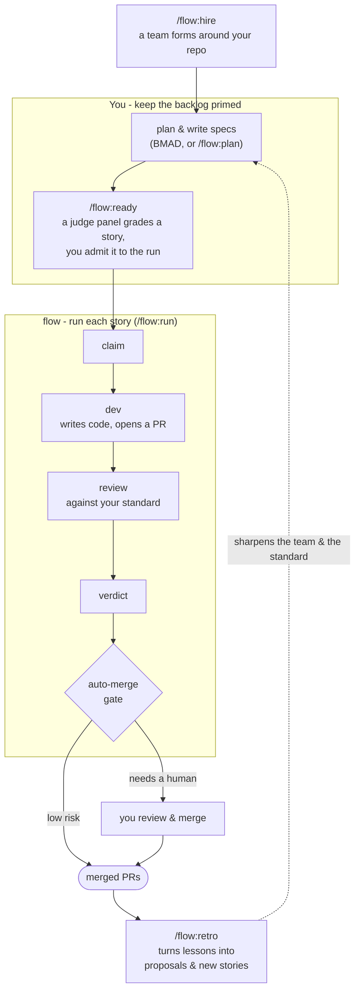

# flow

flow is an experiment. This is me testing a hypothesis in the open.

The hypothesis: someone with broad technology experience, who isn't a software engineer by trade but knows enough to be dangerous, can run the work of a whole product engineering team using AI agents, without giving up the rigour a good scrum team enforces.

I spent years as a scrum master and delivery lead. I sat next to engineers, testers, analysts and designers for a long time without doing any of those jobs myself. The bet here is that the next iteration of agile is fewer people performing multiple roles, with the strength of an AI behind each of them. flow is that bet, built.

## What it is

flow is a Claude Code plugin that runs the execution half of that team. You plan the work and write the specs with a tool built for it, then flow takes the backlog and drives each story through hiring, dev, review and merge, judged against a written standard you control. You stay in the product loop, deciding what to build and what counts as done. The agents do the engineering.

The split is deliberate. I plan with BMAD, which is genuinely good at shaping a backlog and writing a spec. flow is still relatively immature at that, so it doesn't try to compete: its job is taking a good spec and shipping it. Use the right tool for each half.

flow runs through a handful of commands:

- `/flow:hire` reads your repo and proposes a starting team of roles.
- `/flow:ready` grades a backlog item with a panel of judges and admits it to the run.
- `/flow:run` claims a story and takes it through dev, review, a verdict and an auto-merge gate, with each developer working in its own isolated copy.
- `/flow:retro` looks back over a cycle and turns what it learned into proposals or new backlog stories.

`/flow:plan` is there for drafting a story in a pinch, and on a BMAD repo it hands you to BMAD's authoring skills and pulls the result back into the backlog. Plus `/flow:dashboard` for a status read, `/flow:help` for the next sensible move, and `/flow:ask` to put a single question to a hired role.

## How it works

You keep the backlog primed. flow turns it into merged PRs, and sharpens itself each cycle.



## Status

This is in active development and it is not finished. The plan-to-merge loop works end to end, and flow has shipped real pull requests into this repo by running on itself. What's still moving: the command surface, the learning loop that lets the team get sharper cycle over cycle, and the cold install path for someone who isn't me. Treat it as a working experiment, not a product.

## Install

Start at [`plugins/flow/docs/README-install.md`](plugins/flow/docs/README-install.md). It walks you from clone to the plugin seeing your repo.

## Repository layout

```
plugins/flow/      the plugin (MCP server, skills, role catalogue, docs)
plugins/flow/docs/ install walkthrough, dev loop, standards template
```

## License

MIT. See [LICENSE](LICENSE).
